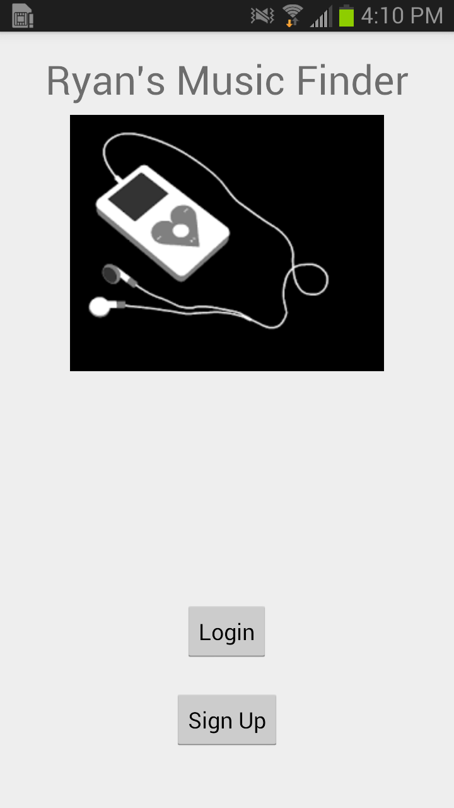

# music-finder
Sample Mixpanel App

This sample app uses the [Mixpanel SDK](https://github.com/mixpanel/mixpanel-android) to implement features such as:

- Tracking Events
- Creating People Profiles
- Updating various Super & People Properties
- Receiving and Registering for Notifications
- Debug and Error Logging for Mixpanel
- Apple Watch Integration with Mixpanel

This example is based off of the popular "Music Finder" example app from the [Mixpanel Webinar](https://mixpanel.com/help/questions/articles/webinar-resource-page).

